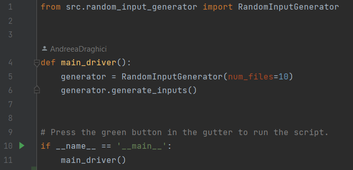

## Overview

The Random Input Generator is a simple Python tool designed to generate random input files for[ Multi-Arm Bandit
Agent ](https://github.com/AndreeaDraghici/Multi-Arm-Bandit-Agent) simulations. This tool is useful for creating diverse
sets of input parameters for testing and experimentation with
Multi-Arm Bandit algorithms.

## Usage

### 1. Installation

Clone the repository to your local machine:

``git clone <repository_url>``

`cd <repository_directory>`

### 2. Dependencies

Make sure to install the required dependencies. You can install them using the following command:

`pip install -r requirements.txt`

### 3. Configuration

The tool uses a logging configuration file (logging_config.yml) to set up logging. The tool uses logging to provide
information about the generation process.

### 4. Running the Generator

To generate random input files, instantiate the RandomInputGenerator class and call the generate_inputs method. By
default, the tool generates 10 input files, each containing random values for the number of arms, total iterations, and
epsilon.

The generated input files will be saved in the 'input' directory.

### 5. Input File Format

Each input file (input{i}.txt) follows the format:

`{num_arms}`

`{num_iterations}`

`{epsilon}`

* num_arms: Random number of arms (between 2 and 10).

* num_iterations: Random number of iterations (between 500 and 1500).

* epsilon: Random epsilon value (between 0.05 and 0.3).

## History

Version 1.0.0 - Initial version of tool